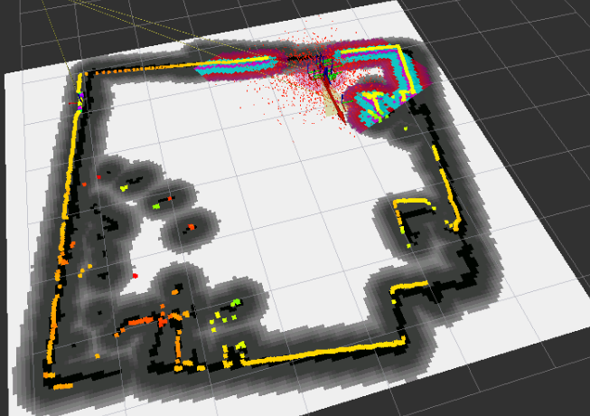
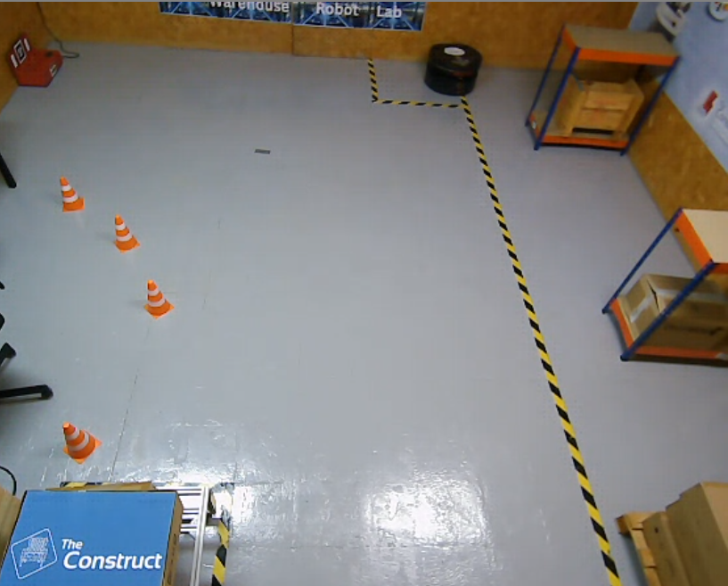

# Checkpoint 11  The Construct ros2 Navigation

## Task 1   Mapping

### Simulation
Result

- Terminal 1
source ~/sim_ws/install/setup.bash
ros2 launch the_construct_office_gazebo warehouse_rb1.launch.xml

- Terminal 2
ros2 launch cartographer_slam cartographer.launch.py env_type:=sim

- Terminal 3
cd ros2_ws/src/warehouse_project
rviz2 -d cartographer_slam/config/rviz2_config.rviz

- Terminal 4
ros2 run teleop_twist_keyboard teleop_twist_keyboard --ros-args  -r cmd_vel:=/diffbot_base_controller/cmd_vel_unstamped

### Real Robot
Result

- Terminal 1
ros2 launch cartographer_slam cartographer.launch.py env_type:=real

- Terminal 2
ros2 run teleop_twist_keyboard teleop_twist_keyboard 

## Task 2   Localization 

### Simulation
- Terminal 1
source ~/sim_ws/install/setup.bash
ros2 launch the_construct_office_gazebo warehouse_rb1.launch.xml

- Terminal 2
ros2 launch localization_server localization.launch.py map_file:=warehouse_map_sim.yaml
 or for real robot
ros2 launch localization_server localization.launch.py map_file:=warehouse_map_real.yaml

- Terminal 3
ros2 run teleop_twist_keyboard teleop_twist_keyboard --ros-args  -r cmd_vel:=/diffbot_base_controller/cmd_vel_unstamped

### Real Robot
Result

- Terminal 1
ros2 launch localization_server localization.launch.py map_file:=warehouse_map_real.yaml

- Terminal 2
ros2 run teleop_twist_keyboard teleop_twist_keyboard 

## Task 3   Navigation

### Simulation
- Terminal 1
source ~/sim_ws/install/setup.bash
ros2 launch the_construct_office_gazebo warehouse_rb1.launch.xml

- Terminal 2
ros2 launch localization_server localization.launch.py map_file:=warehouse_map_sim.yaml

- Terminal 3
ros2 launch path_planner_server pathplanner.launch.py 
or
ros2 launch path_planner_server pathplanner.launch.py env_type:=sim

### Real Robot
Result 

- Terminal 1
ros2 launch localization_server localization.launch.py map_file:=warehouse_map_real.yaml

- Terminal 2
ros2 launch path_planner_server pathplanner.launch.py env_type:=real

#### Useful commands
------------------- View Frames ------------------------------
ros2 run tf2_tools view_frames
------------------- Simulation ------------------------------
- To move robot
ros2 run teleop_twist_keyboard teleop_twist_keyboard --ros-args  -r cmd_vel:=/diffbot_base_controller/cmd_vel_unstamped
------------------- Real Robot ------------------------------
- To move robot
ros2 run teleop_twist_keyboard teleop_twist_keyboard 