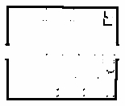
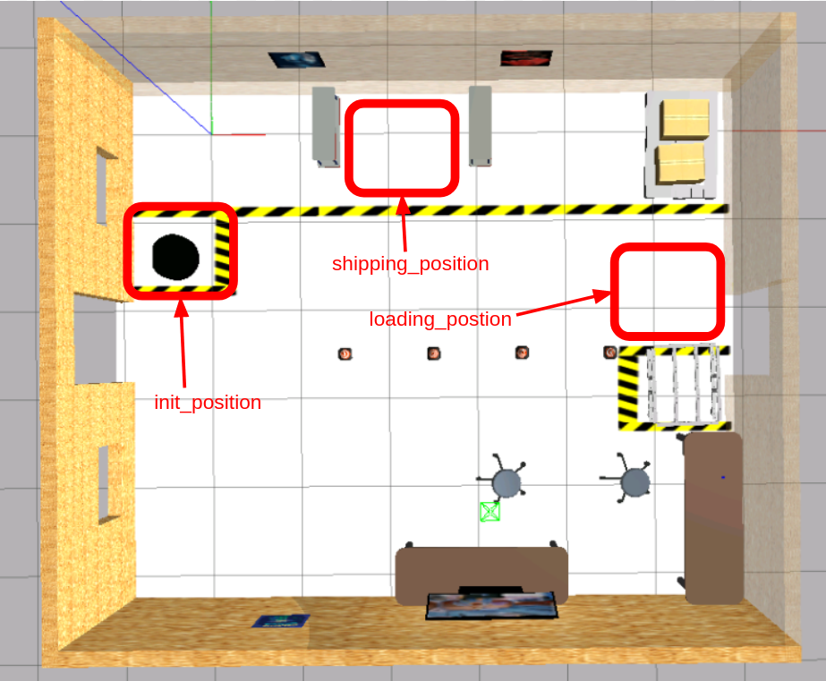
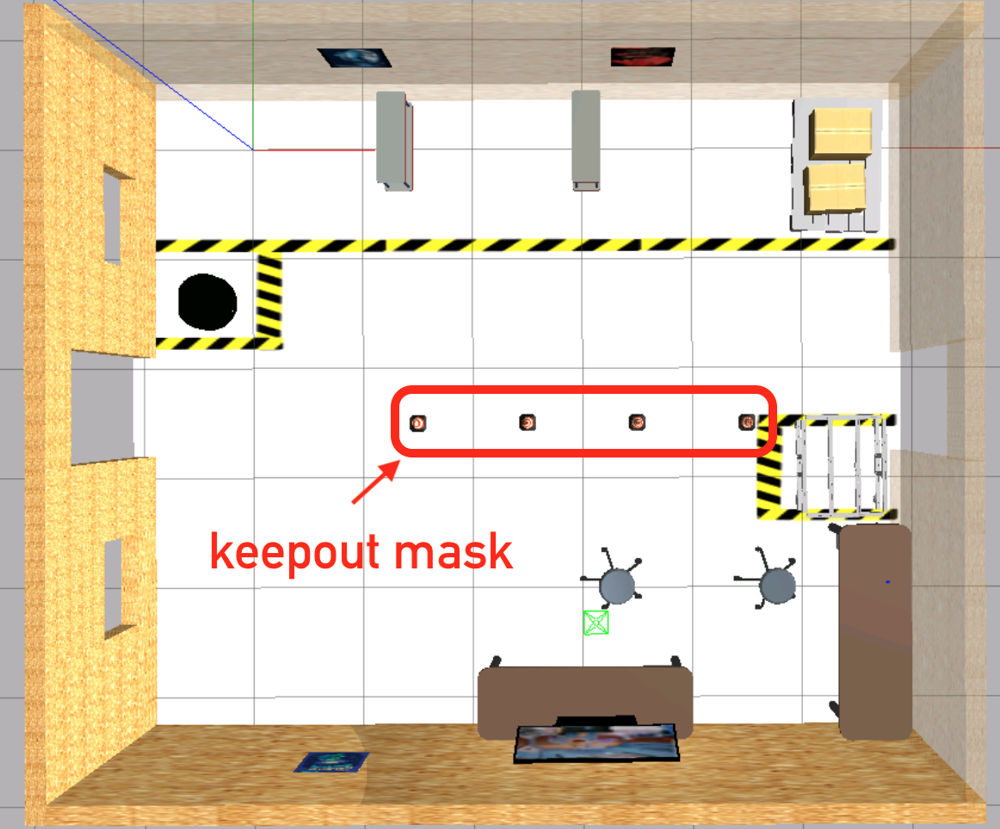

# Checkpoint 11  Home's version of The Construct ros2 Navigation

## Task 1   Mapping

### Simulation
Result

- Terminal 1
source ~/sim_ws/install/setup.bash
ros2 launch the_construct_office_gazebo_cp11_cp12 warehouse_rb1.launch.xml

- Terminal 2
ros2 launch cartographer_slam_cp12 cartographer.launch.py env_type:=sim

- Terminal 3
cd ros2_ws/src/warehouse_project
rviz2 -d cartographer_slam_cp12/config/rviz2_config.rviz

- Terminal 4
ros2 run teleop_twist_keyboard teleop_twist_keyboard --ros-args  -r cmd_vel:=/diffbot_base_controller/cmd_vel_unstamped


## Task 2   Localization 

### Simulation
- Terminal 1
source ~/sim_ws/install/setup.bash
ros2 launch the_construct_office_gazebo_cp11_cp12 warehouse_rb1.launch.xml

- Terminal 2
ros2 launch localization_server_cp12 localization.launch.py map_file:=warehouse_map_sim.yaml

Go to RVIZ and click Pose Estimation Button, and click the robot for pose estimation


- Terminal 3
ros2 run teleop_twist_keyboard teleop_twist_keyboard --ros-args  -r cmd_vel:=/diffbot_base_controller/cmd_vel_unstamped


## Task 3   Navigation

### Simulation
- Terminal 1
source ~/sim_ws/install/setup.bash
ros2 launch the_construct_office_gazebo_cp11_cp12 warehouse_rb1.launch.xml

- Terminal 2
ros2 launch localization_server_cp12 localization.launch.py map_file:=warehouse_map_sim.yaml

Go to RVIZ and click Pose Estimation Button, and click the robot for pose estimation

- Terminal 3
ros2 launch path_planner_server_cp12 pathplanner.launch.py env_type:=sim

Go to RVIZ and click Goal Pose Button, and click the robot destination

#### Useful commands
------------------- View Frames ------------------------------
ros2 run tf2_tools view_frames
------------------- Simulation ------------------------------
- To move robot
ros2 run teleop_twist_keyboard teleop_twist_keyboard --ros-args  -r cmd_vel:=/diffbot_base_controller/cmd_vel_unstamped
------------------- Real Robot ------------------------------
- To move robot
ros2 run teleop_twist_keyboard teleop_twist_keyboard 


# Checkpoint 12  The Construct ros2 Navigation

Now that the Navigation system is working, and the RB1 robot can navigate autonomously, let's make an application that uses the navigation skill to perform actual tasks using the Simple Commander API.



The goal is the following:

Once the application is launched, it has to localize the robot in the init_position.
Then, make the robot go underneath the shelf that will be near the loading_position and carry it.
Afterwards, move the shelf to the shipping_position while avoiding the cones area completely.
Finally, unload the robot shelf and return to the init_position.

## Result

You can see there is an approximation of the size of robot with cart, and robot radius showing on the robot in RVIZ
Successfully.


Terminal 1

```
cd ~/ros2_ws/
source install/setup.bash
ros2 launch the_construct_office_gazebo_cp11_cp12 warehouse_rb1.launch.xml
```


Terminal 2

```
cd ~/ros2_ws/
source install/setup.bash
ros2 launch localization_server_cp12 localization.launch.py map_file:=warehouse_map_sim.yaml
```

No need to click Pose Estimation on RVIZ


Terminal 3

```
cd ~/ros2_ws/
source install/setup.bash
ros2 launch path_planner_server_cp12 pathplanner.launch.py env_type:=sim
```
No need to click Goal Pose on RVIZ


Terminal 4

```
cd ~/ros2_ws/
source install/setup.bash
python3 ~/ros2_ws/src/Checkpoint12/nav2_apps/scripts/move_shelf_to_ship.py
```
